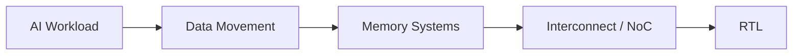

# Shengyi Wei

Digital Design · Computer Architecture 
AI Data Movement · Memory Systems · Interconnect · Performance Modeling

I work on how real AI workloads turn into memory traffic and network traffic. That mapping — from operator to access pattern to bandwidth, latency and topology — is the lens I bring to architecture decisions, simulation and RTL. The goal is to reason about a design before it exists, and to have the model and the hardware agree.

## Current Focus

Open questions I am working through:

- How does decode-phase KV-cache traffic map onto HBM channel and bank parallelism as context length grows?
- Where does collective communication in distributed inference stop being bandwidth-bound and start being topology-bound?
- What does a trace-driven memory model have to capture before its bandwidth numbers are worth trusting?
- Which NoC topology and flow-control choices actually matter once the traffic pattern is taken from a real workload rather than synthetic uniform-random?
- How much of a network datapath can be pinned down in RTL before the workload model is settled?

## Selected Work

Nothing here yet. The portfolio is being rebuilt around a small number of substantial projects; older coursework repositories were retired rather than polished, and this section will fill with links as the new work lands.

Planned directions:

- Workload characterization — operator-level traffic extraction from real inference runs · `in design`
- Memory modeling — HBM bandwidth and latency under AI access patterns · `in design`
- Interconnect simulation — NoC topology and collective traffic · `in design`
- RTL — a network datapath block, from model to synthesizable design · `in design`

## Open Source

No upstream contributions yet. Reading and working toward contributing in: [MLCommons Chakra](https://github.com/mlcommons/chakra), [ASTRA-sim](https://github.com/astra-sim/astra-sim), [Ramulator2](https://github.com/CMU-SAFARI/ramulator2), [gem5](https://github.com/gem5/gem5), [vLLM](https://github.com/vllm-project/vllm) and [SGLang](https://github.com/sgl-project/sglang).

## Technical Writing

[hard-won.github.io](https://hard-won.github.io) — being rebuilt English-first. Earlier Chinese notes on digital design, ASIC synthesis, PCIe and GPU architecture are preserved in an archive.

## Contact

- Website — [hard-won.github.io](https://hard-won.github.io)
- Email — [hardtowon@gmail.com](mailto:hardtowon@gmail.com)
- LinkedIn — [linkedin.com/in/shengyi-wei](https://www.linkedin.com/in/shengyi-wei)
- X — [@TraderTheSean](https://x.com/TraderTheSean)

---

<picture>
  <source media="(prefers-color-scheme: dark)" srcset="https://raw.githubusercontent.com/hard-won/Hard-won/output/github-snake-dark.svg">
  <source media="(prefers-color-scheme: light)" srcset="https://raw.githubusercontent.com/hard-won/Hard-won/output/github-snake.svg">
  
</picture>
